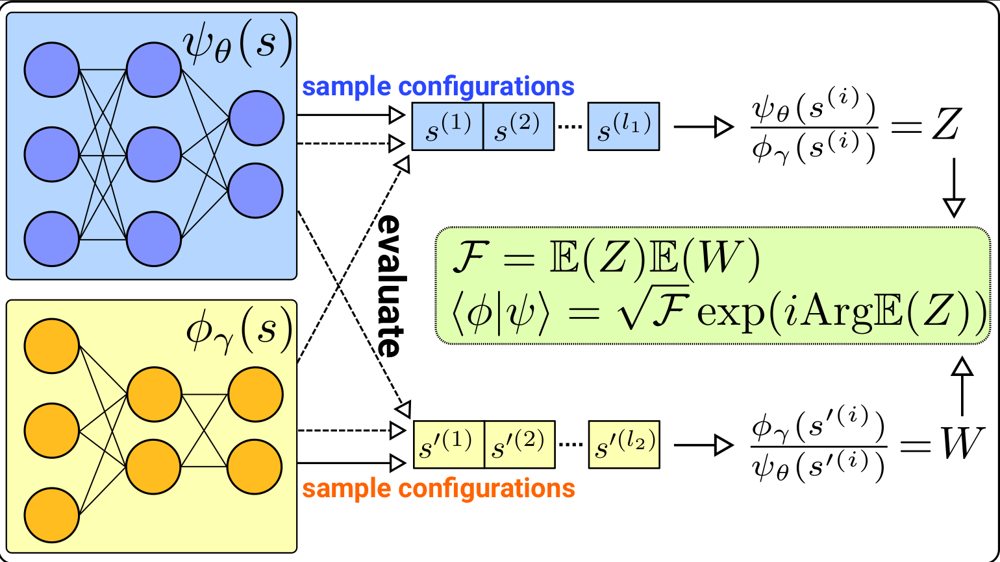

# Fidelity / overlap calculation for Neural Quantum States with jVMC

## Code accompanying Tomasz Szoldra, arXiv:XXXX.XXXX

### Compatibility: jVMC v. 1.2.4

Main code for overlap calculation is in `overlap.py`. There is also a custom exact sampler in `custom_exact_sampler.py` which supports calculation in
chunks to avoid out-of-memory errors for large systems in exact overlap calculations.

Examples of usage are in `examples/`.

    $ cd examples; python time_evol_1D_TFIM-ARNN.py --help

    usage: time_evol_1D_TFIM-ARNN.py [-h] [--n_steps N_STEPS] [--n_Samples N_SAMPLES] [--hiddenSize HIDDENSIZE] [--depth DEPTH] [--timeStep TIMESTEP] [--batchSize BATCHSIZE] [--no_overlap_exact]
                                     [--numChunks NUMCHUNKS] [--numSamples_MC_overlap NUMSAMPLES_MC_OVERLAP] [--verbose] [--numFidelityBins NUMFIDELITYBINS] [--fidelityBinsMin FIDELITYBINSMIN]
                                     [--fidelityBinsMax FIDELITYBINSMAX]
                                     L g seed
    
    Computes time evolution of random NQS with 1D TFIM Hamiltonian. Calculates `numFidelityBins` fidelity and overlap estimates, each within a single bin, where bins range from `fidelityBinsMin` to `fidelityBinsMax`.
    Uses autoregressive Ansatz with multi-layer RNN.
    
    positional arguments:
      L                     System size.
      g                     Amplitude of sigma_x in the Hamiltonian.
      seed                  Random seed.
    
    optional arguments:
      -h, --help            show this help message and exit
      --n_steps N_STEPS     Number of time steps. (default: 2000)
      --n_Samples N_SAMPLES
                            Number of MC samples in the time evolution by SR. (default: 200)
      --hiddenSize HIDDENSIZE
                            Hidden size of RNN. (default: 2)
      --depth DEPTH         Vertical depth of RNN. (default: 2)
      --timeStep TIMESTEP   Time step of Euler integrator. (default: 0.0005)
      --batchSize BATCHSIZE
                            Batch size for time integrator. Use power of 2. (default: 8192)
      --no_overlap_exact    Do not calculate the exact overlap and always return crude MC estimate. (default: False)
      --numChunks NUMCHUNKS
                            Number of chunks of the full exact basis. Use even number. (default: 1)
      --numSamples_MC_overlap NUMSAMPLES_MC_OVERLAP
                            Number of samples in the crude MC overlap estimation. (default: 512)
      --verbose             Print additional output. (default: False)
      --numFidelityBins NUMFIDELITYBINS
                            Number of fidelity bins. (default: 10)
      --fidelityBinsMin FIDELITYBINSMIN
                            Fidelity bins minimal value. (default: 0.0)
      --fidelityBinsMax FIDELITYBINSMAX
                            Fidelity bins maximal value. (default: 1.0)
 
_______________________________
    $ cd examples/; python time_evol_1D_TFIM-CpxRBM.py --help
    usage: time_evol_1D_TFIM-CpxRBM.py [-h] [--n_steps N_STEPS] [--n_Samples N_SAMPLES] [--hiddenSize HIDDENSIZE] [--bias] [--timeStep TIMESTEP] [--batchSize BATCHSIZE] [--numChains NUMCHAINS]
                                   [--sweepSteps SWEEPSTEPS] [--thermalizationSweeps THERMALIZATIONSWEEPS] [--no_overlap_exact] [--numChunks NUMCHUNKS] [--numSamples_MC_overlap NUMSAMPLES_MC_OVERLAP]
                                   [--verbose] [--numFidelityBins NUMFIDELITYBINS] [--fidelityBinsMin FIDELITYBINSMIN] [--fidelityBinsMax FIDELITYBINSMAX]
                                   L g seed

    Computes time evolution of random NQS with 1D TFIM Hamiltonian. Calculates `numFidelityBins` fidelity and overlap estimates, each within a single bin, where bins range from `fidelityBinsMin` to `fidelityBinsMax`.
    Uses RBM Ansatz with complex weights.
    
    positional arguments:
      L                     System size.
      g                     Amplitude of sigma_x in the Hamiltonian.
      seed                  Random seed.
    
    optional arguments:
      -h, --help            show this help message and exit
      --n_steps N_STEPS     Number of time steps. (default: 2000)
      --n_Samples N_SAMPLES
                            Number of MC samples in the time evolution by SR. (default: 200)
      --hiddenSize HIDDENSIZE
                            Number of hidden units. (default: 2)
      --bias                Use bias. (default: False)
      --timeStep TIMESTEP   Time step of Euler integrator. (default: 0.0005)
      --batchSize BATCHSIZE
                            Batch size for time integrator. (default: 8192)
      --numChains NUMCHAINS
                            Number of MCMC chains run in parallel. (default: 100)
      --sweepSteps SWEEPSTEPS
                            Number of MCMC steps for a sweep (in units of system size L) (default: 1)
      --thermalizationSweeps THERMALIZATIONSWEEPS
                            Number of MCMC sweeps used for initial thermalization (burn-in). (default: 25)
      --no_overlap_exact    Do not calculate the exact overlap and always return crude MC estimate. (default: False)
      --numChunks NUMCHUNKS
                            Number of chunks of the full exact basis. Use even number. (default: 1)
      --numSamples_MC_overlap NUMSAMPLES_MC_OVERLAP
                            Number of samples in the crude MC overlap estimation. (default: 512)
      --verbose             Print additional output. (default: False)
      --numFidelityBins NUMFIDELITYBINS
                            Number of fidelity bins. (default: 10)
      --fidelityBinsMin FIDELITYBINSMIN
                            Fidelity bins minimal value. (default: 0.0)
      --fidelityBinsMax FIDELITYBINSMAX
                            Fidelity bins maximal value. (default: 1.0)
